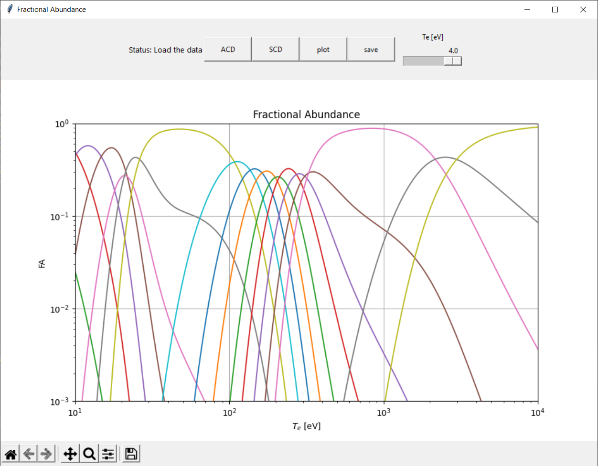

# Fractional Abundance

As an example, we will determine the FA for Li, with the following assumptions for the plasma:
- The plasma is rare, so collisional recombination involving two electrons is
unlikely (negligible),
- The plasma is optically thin, i.e., the plasma does not absorb radiation, so ionization
due to absorption of energy hν is negligible,
- We assume a stationary state i.e. that changes occur slowly.

All kinetic equations describing the incomplete thermodynamic equilibrium of ionization and
recombination are as follows:  

### Collision ionization
Associated with collisional ionization is the $k_{SCD}$ $frac{cm^{3}}{s}$ (Effective Ionization Coefficient):  

$Li^{0} + e^{-} \rightarrow Li^{1+} + 2e^{-} \quad (k^{01}_{SCD})$  

$Li^{1+} + e^{-} \rightarrow Li^{2+} + 2e^{-}  \quad (k^{12}_{SCD})$

$Li^{2+} + e^{-} \rightarrow Li^{3+} + 2e^{-}  \quad  (k^{23}_{SCD})$

### Collision recombination  
Associated with collisional recombination is the $k_{ACD}$ $frac{cm^{3}}{s}$ (Effective Recombination Coefficient):  

$Li^{1+} + e^{-} \rightarrow Li^{0} + h\nu \quad (k^{10}_{ACD})$  

$Li^{2+} + e^{-} \rightarrow Li^{1+} + h\nu  \quad (k^{21}_{ACD})$  

$Li^{3+} + e^{-} \rightarrow Li^{2+} + h\nu  \quad  (k^{32}_{ACD})$

### Rate equations

A set of kinetic equations describing the change in the value of a given ion over time is represented by the following equations, which for coronal equilibrium should be equal to 0.  

$\large  \frac{dn_{0}}{dt}$ $= k^{10}{ACD} n_1 n_e$ - $k^{01}{SCD} n_{0} n_{e} = 0$

$\large  \frac{dn_{1}}{dt} = k^{01}{SCD}n_{0}n_{e} - k^{12}{SCD}n_{1}n_{e} + k^{21}{ACD}n_{2}n_{e} - k^{10}{ACD}n_{1}n_{e} = 0 $ 

$\large  \frac{dn_{2}}{dt} = k^{12}{SCD}n_{1}n_{e} - k^{23}{SCD}n_{2}n_{e} + k^{32}{ACD}n_{3}n_{e} - k^{21}{ACD}n_{2}n_{e} = 0 $

$\large \frac{dn_{3}}{dt} = k^{23}{SCD}n_{2}n_{e} - k^{32}{ACD}n_{3}n_{e} = 0$

Each of the coefficients $k_{SCD}$, $k_{ACD}$ and thus $K$ depends on the temperature $T_{e}$ and density $N_{e}$.  

### Fractional Abundance  

$FA(Li^{0})=\frac{n_{0}}{n_{0}+n_{1}+n_{2}+n_{3}}=\frac{K_{0}}{K_{0}+K_{0}\cdot K_{1}+K_{0}\cdot K_{1}\cdot K_{2}+K_{0} \cdot K_{1}\cdot K_{2} \cdot K_{3}}$  

$FA(Li^{1+})=\frac{n_{0}}{n_{0}+n_{1}+n_{2}+n_{3}}=\frac{K_{0}\cdot K_{1}}{K_{0}+K_{0}\cdot K_{1}+K_{0}\cdot K_{1}\cdot K_{2}+K_{0} \cdot K_{1}\cdot K_{2} \cdot K_{3}}$  

$FA(Li^{2+})=\frac{n_{0}}{n_{0}+n_{1}+n_{2}+n_{3}}=\frac{K_{0}\cdot K_{1} \cdot K_{2}}{K_{0}+K_{0}\cdot K_{1}+K_{0}\cdot K_{1}\cdot K_{2}+K_{0} \cdot K_{1}\cdot K_{2} \cdot K_{3}}$  

$FA(Li^{3+})=\frac{n_{0}}{n_{0}+n_{1}+n_{2}+n_{3}}=\frac{K_{0}\cdot K_{1} \cdot K_{2} \cdot K_{3}}{K_{0}+K_{0}\cdot K_{1}+K_{0}\cdot K_{1}\cdot K_{2}+K_{0} \cdot K_{1}\cdot K_{2} \cdot K_{3}}$  

The above formulas can be written in abbreviated notation:

$FA(Li^{ i+})=\frac{\prod_{j=0}^{i}K_{j}}{\sum_{k=0}^{Z}\prod_{j=0}^{k}K_{j}}$ 

### Implementation  

### GUI - tkinter
